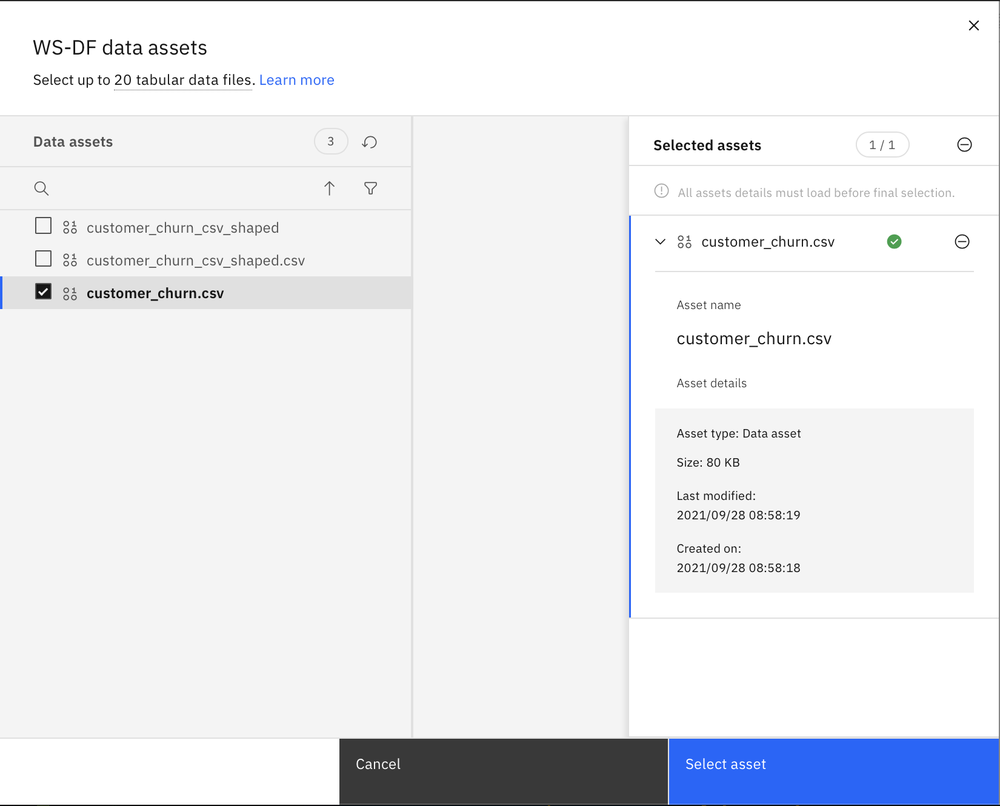

# Rapid Machine Learning Development using Low Code Applications

## Workshop Resources

- Login/Sign Up for IBM Cloud: https://ibm.biz/RapidML
  
- Hands-On Guide: https://ibm.biz/RapidML-HandsOn

- Slides: https://ibm.biz/RapidML-Slides

## Table of Contents
1. [Prerequisites](#Prerequisites)
1. [About the Workshop](#About-the-Workshop)
1. [Tutorial](#Tutorial)
	* [Step 1. Create Cloud Pak for Data as a Service (Watson Studio)](#step-1-create-cloud-pak-for-data-as-a-service--watson-studio-)
	* [Step 2. Create Object Storage](#step-2-create-object-storage)
	* [Step 3. Create a Watson Machine Learning Service instance](#step-3-create-a-watson-machine-learning-service-instance)
	* [Step 4. Download/Clone the repository](#step-4-download-clone-the-repository)
	* [Step 5. Create a new project](#step-5-create-a-new-project)
	* [Step 6. Upload the data](#step-6-upload-the-data)
	* [Step 7. Clean your data](#step-7-clean-your-data)
	* [Step 8. Create an AutoAI Experiment](#step-8-create-an-autoai-experiment)
	* [Step 9. Save the AutoAI Model](#step-9-save-the-autoai-model)
	* [Step 10. Deploy the model](#step-10-deploy-the-model)
	* [Step 11. Test the model](#step-11-test-the-model)
1. [Workshop Resources](#workshop-resources-1)
1. [Reference Links](#reference-links)
1. [Done with the workshop? Here are some things you can try further](#done-with-the-workshop-here-are-some-things-you-can-try-further)
1. [Workshop Speakers](#workshop-speakers)

## Prerequisites
  
### **Sign-up/Login to IBM Cloud**

If you are an existing user please [login to IBM Cloud](https://cloud.ibm.com/registration/trial?utm_medium=Inpersondirected&utm_content=000039JL&utm_term=10010797&utm_id=Nov2021-theafricanapplaunchpadaal-eventid-617943745a388dd980411c58-global-devadvgrp-dubai-franchise-conference-cairo)

And if you are not, don't worry! We have got you covered! There are 3 steps to create your account on [IBM Cloud](https://cloud.ibm.com/registration/trial?utm_medium=Inpersondirected&utm_content=000039JL&utm_term=10010797&utm_id=Nov2021-theafricanapplaunchpadaal-eventid-617943745a388dd980411c58-global-devadvgrp-dubai-franchise-conference-cairo): <br>
1- Put your email and password. <br>
2- You get a verification link with the registered email to verify your account. <br>
3- Fill the personal information fields. <br>
** Please make sure you select the country you are in when asked at any step of the registration process.
  


## About the workshop 
AutoAI is a tool that automates machine learning tasks to ease the tasks of data scientists. It automatically prepares your data for modeling, chooses the best algorithm for your problem, and creates pipelines for the trained models, and it can be run in public clouds and in private clouds, including IBM Cloud Pak for Data.

This tutorial explains the benefits of the AutoAI tool on a use case. This will give you a better understanding of how regression and classification problems can be handled without any code — and how the tasks (feature engineering, model selection, hyperparameter tuning, etc.) are done with this service. This tutorial also includes details for choosing the best model among the pipelines and how to deploy and use these models via IBM Cloud Pak for Data platform.

Customer churn is an important aspect for any business, it gives them insights about their prospective customers. In this tutorial we will be predicting customer churn of car owners. We will be utilizing Watson data refinery to alter our data, and then use AutoAI to rapdliy develop a classfication machine learning model in a matter of minutes and predict our customer chrun.

## Architecture   


## Tutorial

### Step 1. Create Cloud Pak for Data as a Service (Watson Studio)
 On top of the page, you will see a search bar. Search for "Watson Studio". Watson Studio service will show up. Click on it, if you already have an instance of Watson Studio, it should be visible. If so, click it. If not, click Watson Studio under Catalog Results to create a new service instance.


Select the type of plan to create if you are creating a new service instance. A Lite (free) plan should suffice for this tutorial). Click Create.


### Step 2. Create Object Storage

Search for "Object Storage". Object Storage service will show up. Click on it. If you already have an instance of Object Storage, it should be visible. If so, click it. If not, click Object Storage under Catalog Results to create a new service instance.


### Step 3. Create a Watson Machine Learning Service instance

To create a Watson Machine Learning instance, search for Machine Learning and create a lite instance. If you already have an instance of Machine Learning, it should be visible. If so, click it. If not, click Machine Learning under Catalog Results to create a new service instance.


### Step 4. Download/Clone the repository

``` 
git clone https://github.com/IBMDeveloperMEA/Rapid-Machine-Learning-Development-using-Low-Code-Applications
```

To download this repository, click [here](https://github.com/IBMDeveloperMEA/Rapid-Machine-Learning-Development-using-Low-Code-Applications/archive/refs/heads/main.zip) Or click on the green code icon, and download the ZIP file. You will need the repository for the data that is required for this tutorial.


### Step 5. Create a new project

Search for your Watson Studio instance, and click on the ```Get Started``` button.

In Watson Studio, we use the concept of a project to collect and organize the resources used to achieve a particular goal (resources to build a solution to a problem). Your project resources can include data, collaborators, and analytic assets like notebooks and models, etc.

To create a new project, you can either:

1. Click Create a project from the Watson Studio home page


2. Or, click on Projects -> View all projects in the left-side navigation menu (☰), then click New project +


3. On the create project panel, you can either create an empty project, or import a file that contains project assets.


4. When creating a new project, you will need to provide a unique project name, and an object storage instance. For Storage, you should select the IBM Cloud Object Storage service you created in the previous step. If it is the only storage service that you have provisioned, it is assigned automatically.


5. Click Create to finish creating the project.

### Step 6. Upload the data

As you have downloaded this repository, you will find the data in the `data` folder called ```customer_churn.csv```.

1. From your Watson Studio project panael, select Assets.

2. If not already open, click the 1000 data icon at the upper right of the panel to open the Files sub-panel. Then, click Load.


3. Drag the file to the drop area to upload the data into Watson Studio.

4. Wait until the file has been uploaded.

### Step 7. Clean your data

In this step we will use data refinery to manipulate the data. We will be using the data from the previous step that you have uploaded and going to change the chrun column to a binary column.

 1. In your project panel, you should see your data set, click on it


 2. Once open, click on the refine icon at the upper right of the panel to open the Data Refinery sub-panel.


 3. Select the ```CHRUN``` column and select ```convert column``` and select ```String``` as the new column type.


 4. Once converted, select the ```CHRUN``` column again, and click on ```Operation``` to open the Operation sub-panel.


 5. Select the ```Conditional Replace``` operation and add the following conditions:
  - If the value is ```TRUE```, replace it with ```1```
  - If the value is ```FALSE```, replace it with ```0```

It should look like this in the GUI
  


 6. Click on ```Apply``` to apply the changes.

 7. Once again, select the ```CHRUN``` column and click on the three dots on the top right of the column, and select the ```Convert Column``` option, and proceed with integer.

  

 8. Finally on the top right of the panel, you should see a ```save and create a job``` option, click on it and follow the steps.

   

 9. Once completed, go back to your project and you should see your cleaned data in the ```Assets``` section. 

  
  

You have now cleaned and modified your data, let's move on to the next step!

### Step 8. Create an AutoAI Experiment

 1. To start the AutoAI experience, click **Add to Project +** from the top and select **AutoAI experiment**.


 2. Name your AutoAI experiment asset and leave the default compute configuration option listed in the drop-down menu, then click **Create**.


 3. To configure the experiment, we must give it the dataset to use. Click on the **Select from project** option.


 4. In the dialog, select the original dataset that is included in the repository, then click **Select asset**. We are using the original dataset as it has already been cleaned.



5. Once the dataset is read in, we need to indicate what we want the model to predict. Under the Select prediction column, find and click on the **Churn** row. And click on ```run experiment``` to start the experiment.


6. The AutoAI experiment will run and the UI will show progress as it happens.


7. The UI will show progress as different algorithms/evaluators are selected and as different pipelines are created and evaluated. You can view the performance of the pipelines that have completed by expanding each pipeline section.

8. The experiment can take several minutes to run. Upon completion, you will see a message that the pipelines have been created.


### Step 9. Save the AutoAI Model

The AutoAI process by default selects top-two performing algorithms for a given dataset. After executing the appropriate data pre-processing steps, it follows this sequence for each of the algorithms to build candidate pipelines:

* Automated model selection
* Hyperparameter optimization
* Automated feature engineering
* Hyperparameter optimization

You can review each pipeline and select to deploy the top performing pipeline from this experiment.

1. Scroll down to see the Pipeline leaderboard. The top-performing pipeline is in the first rank.

2. The next step is to select the model that gives the best result by looking at the metrics. In this case, Pipeline 4 gave the best result with the metric "Accuracy (optimized)". You can view the detailed results by clicking the corresponding pipeline from the leaderboard.


3. The model evaluation page will show metrics for the experiment, feature transformations performed (if any), which features contribute to the model, and more details of the pipeline.


4. To deploy this model, click on **Save as**, then **Model** to save it.

5. A window opens that asks for the model name, description (optional), etc. You can accept the defaults or give your model a meaningful name/description and then click **Save**.


6. You receive a notification to indicate that your model is saved to your project. Go back to your project main page by clicking on the project name on the navigator on the top left.


You will see the new model under the Models section of the Assets page.


## Step 10. Deploy the model

1. Under the Models section of the Assets page, click the name of your saved model.

2. To make the model available to be deployed, we need to make it available in the deployment space. Click on **Promote to deployment space**.


3. To promote an asset, the project must first be associated with a deployment space. Click **Associate Deployment Space**.


4. You may have already created a deployment space. In that case, click on the **Existing** tab and choose that deployment, then click **Associate**.


5. If you do not have an existing deployment, go to the New tab, give a name for your deployment space, then click **Associate**.


6. From the model page, once again click on **Promote to deployment space**, then click **Promote to space** in the dialog box that pops up to confirm.


7. This time you will see a notification that the model was promoted to the deployment space succesfully. Click **Deployment space** from this notification. You can also reach this page by using the hamburger (☰) menu and clicking **Deployments > View All Spaces** and click on your deployment space.


8. Under the Assets tab, click on the AutoAI model you just promoted.


9. Click **Create deployment** in the top-right corner.


10. On the Create a deployment screen, choose **Online** for the deployment type, give the deployment a name and an optional description, then click **Create**.


11. The deployment will show as "In progress" and switch to "Deployed" when done.


Once the model is deployed we will go ahead with testing the model. 

### Step 11. Test the model

IBM Cloud Pak for Data as a Service offers tools to quickly test out Watson machine learning models. We begin with the built-in tooling.

1. Click on the deployment. The deployment API reference tab shows how to use the model using Curl, Java, JavaScript, Python, and Scala. Click on the corresponding tabs to get the code snippet in the language you want to use.


2. To get to the built-in test tool, click the **Test** tab, then click on the **Provide input data as JSON** icon and paste the following data under Body:
``` json
{
	"input_data": [
		{
			"fields": [
				"Gender",
				"Status",
				"Children",
				"Est Income",
				"Car Owner",
				"Age",
				"AvgMonthlySpend",
				"CustomerSupportCalls",
				"Paymethod",
				"MembershipPlan"
			],
			"values": [
				[
					"M",
					"S",
					1,
					5762.9,
					"Y",
					43,
					38.96,
					null,
					"CC",
					2
				]
			]
		}
	]
}
```

3. Click the **Predict** button and the model will be called with the input data. The results will display in the Result window. Scroll down to the bottom of the result to see the prediction ("Yes" or a "No" for Churn).


4. Alternatively, you can click the **Provide input using form** icon and input the various fields, then click **Predict**.


## Workshop Resources

- Login/Sign Up for IBM Cloud: https://ibm.biz/RapidML
  
- Hands-On Guide: https://ibm.biz/RapidML-HandsOn

- Slides: https://ibm.biz/RapidML-Slides

## Reference Links

- [Data Science for Developers](https://www.ibm.com/developerworks/community/blogs/data-science-for-developers/)
- [IBM Cloud Pak for Data as a Service](https://www.ibm.com/cloudpakfordata/)
- [Cognitive Class](https://www.cognitiveclass.ai/)
  
## Done with the workshop? Here are some things you can try further

- [Get started with machine learning](https://developer.ibm.com/learningpaths/learning-path-machine-learning-for-developers/)
- [Get started with deep learning](https://developer.ibm.com/learningpaths/learning-path-deep-learning-for-developers/)
- [Supervised deep learning](https://developer.ibm.com/learningpaths/supervised-deep-learning/)

## Workshop Speakers

- [Fawaz Siddiqi](https://linktr.ee/thefaz)
- [Qamar un Nisa](https://www.linkedin.com/in/qamarnisa/)
